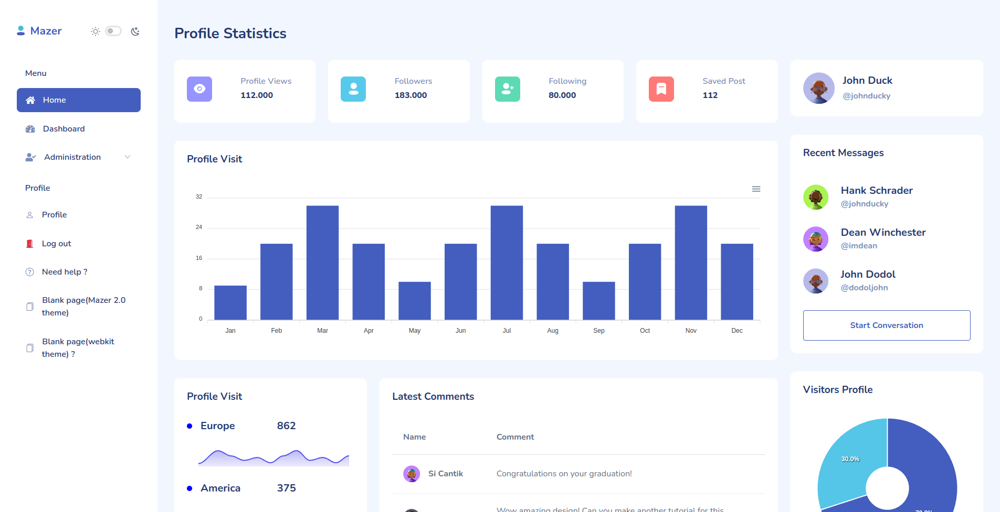
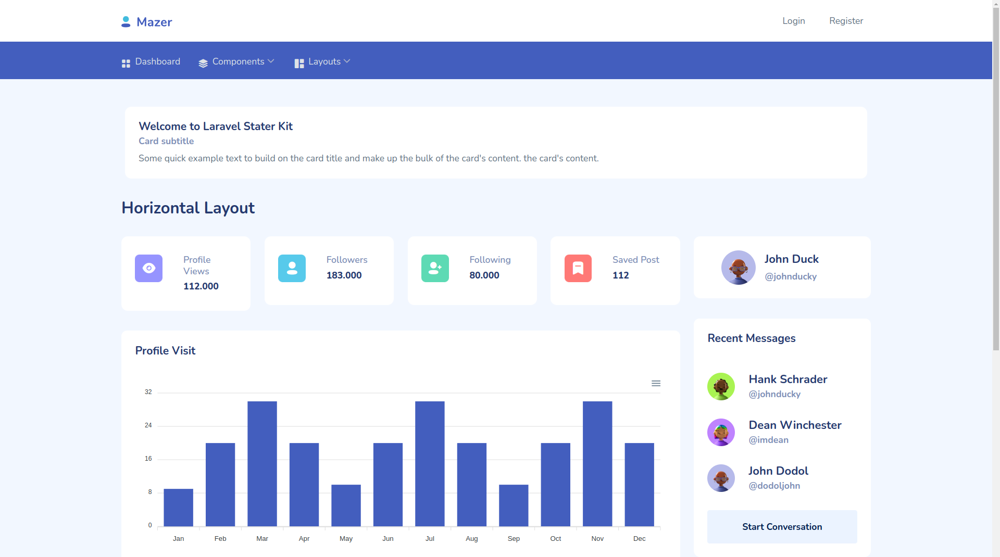
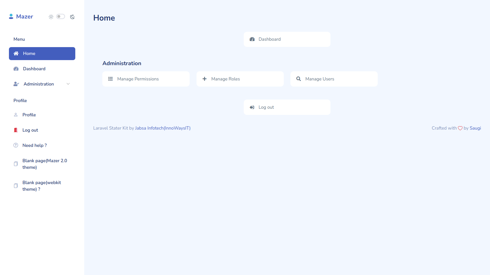
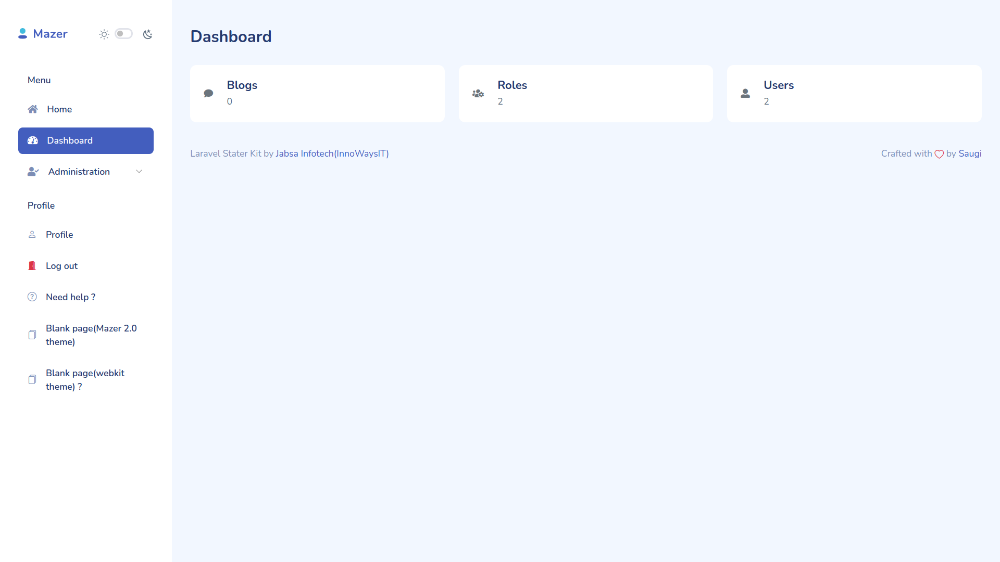
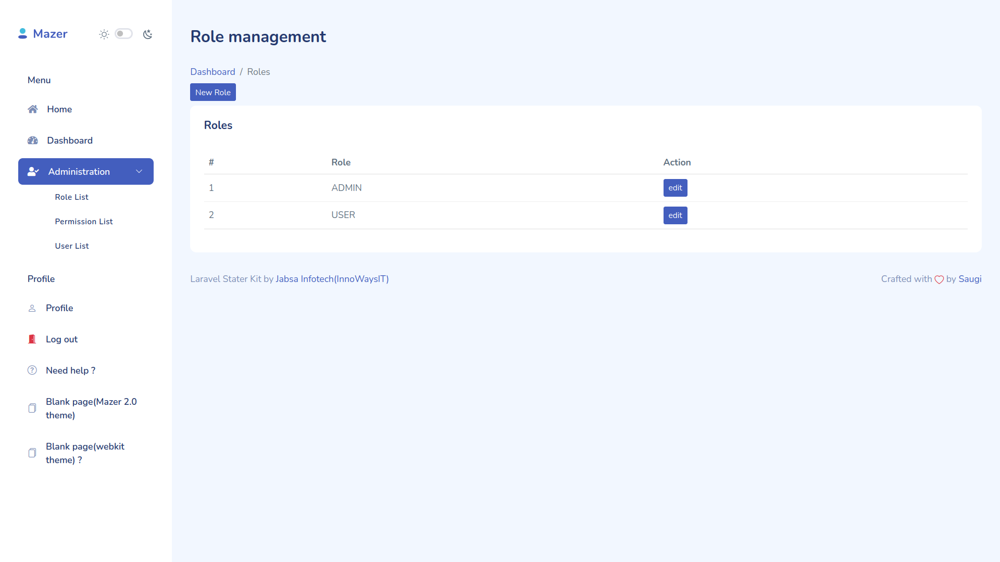

# Laravel stater kit

<hr />

## How to use

Click on Use this template button then follow normal project creation steps in git

Once project is created, clone to your system

    cp .env.example .env
    composer install
    npm install && npm run dev
    php artisan key:generate
    php artisan migrate:fresh --seed
    php artisan serve

## Docker (Sail)

```
cp .env.example .env
docker run --rm -v $(pwd):/opt -w /opt laravelsail/php81-composer:latest composer install
./vendor/bin/sail up -d
./vendor/bin/sail artisan key:generate
./vendor/bin/sail artisan migrate:fresh --seed
```
### Passport Api installation and configuring client id and secret
If you need the api for authentication run the below command
```
php artisan passport:install
```

This will give sample output
e.g.
```
Personal access client created successfully.
Client ID: 1
Client secret: idYopC1DiScLLkjXN7tPh8Wu3QxfViME6nJJurtd
Password grant client created successfully.
Client ID: 2
Client secret: qIiqHzXu58g7DQl8fKiSTFKRFcMzD0napwYi2W6l
```

Paste any one of these keys in your .env file as below
```
PASSPORT_PERSONAL_ACCESS_CLIENT_ID=1
PASSPORT_PERSONAL_ACCESS_CLIENT_SECRET="idYopC1DiScLLkjXN7tPh8Wu3QxfViME6nJJurtd"
```

# TODO

    - WYSIWYG Editor for blog content

## Made with

    - Laravel 9.x
    - larave/ui package
    - Webkit Admin template
    - Spatie Permissions
    - barryvdh/laravel-ide-helper
    - Font Awesome 5 icons

## Screenshots
### New B5 based Stunning Mazer 2.0 Admin theme added


### Home


### Dashboard



### Profile


### Edit Profile


### Edit User with role



### Role list



### Role edit


